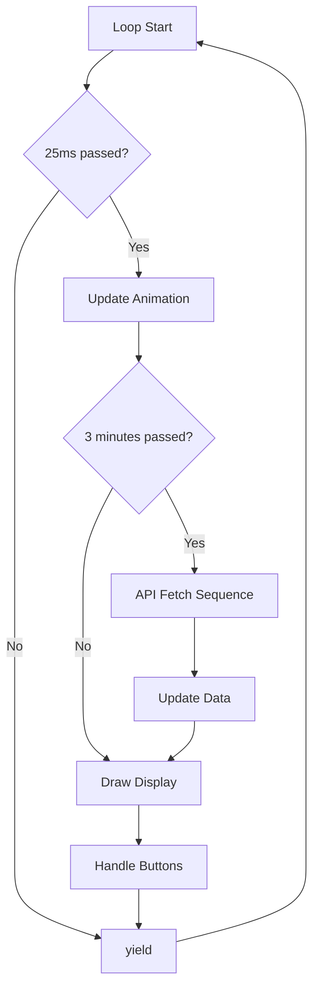

# Weather Micro Station for T-Display S3

A modular, high-performance weather display system for the LILYGO T-Display S3, featuring real-time weather data from OpenWeatherMap API with smooth animations and professional UI.


Inspired from Volos Projects (YouTube): [Let's make Cheap Internet Weather Station using LilyGo T-Display S3 and OpenWeatherMap.org](https://youtu.be/VntDY9Mg7T0?si=NuUndaefoagmdGl1)

## Features

- **Real-time Weather Data**: Fetches current weather from OpenWeatherMap API every 3 minutes
- **Weather Icons**: Visual weather condition icons (18 different conditions) displayed on screen
- **Smooth Animations**: 40 FPS scrolling ticker with professional transitions
- **Modular Architecture**: Clean, maintainable code structure with separate classes
- **Secure Credentials**: API keys and WiFi credentials stored in `secrets.h`
- **Performance Optimized**: Font caching, message buffering, and memory management
- **Brightness Control**: Hardware button support for display brightness adjustment
- **Time Synchronization**: Automatic NTP sync every 30 minutes
- **Error Recovery**: Robust WiFi reconnection and API error handling

## Quick Start

### Prerequisites

- LILYGO T-Display S3 board
- PlatformIO IDE or Arduino IDE
- OpenWeatherMap API key (free at [openweathermap.org](https://openweathermap.org/api))

### Installation

1. **Clone the repository:**

   ```bash
   git clone <repository-url>
   cd weather-micro-station
   ```

2. **Create secrets file:**

   ```bash
   cp include/secrets_template.h include/secrets.h
   ```

3. **Configure your credentials in `include/secrets.h`:**

   ```c
   #define OPENWEATHERMAP_API_KEY "your_api_key_here"
   #define WIFI_SSID "your_wifi_network"
   #define WIFI_PASSWORD "your_wifi_password"
   #define OPENWEATHERMAP_CITY "Your_City"
   ```

4. **Build and upload:**

   ```bash
   pio run --target upload
   ```

## Architecture Overview

### Project Structure

```
weather-micro-station/
├── src/
│   ├── main.cpp              # Main application entry point
│   ├── config.h              # Non-sensitive configuration constants
│   ├── weather_data.h        # Data structures and types
│   ├── weather_display.h/cpp # Display management and UI rendering
│   └── weather_api.h/cpp     # API client and network operations
├── include/
│   ├── secrets.h             # Secure credentials (not in git)
│   ├── secrets_template.h    # Template for secure credentials
│   └── *.h                   # Font files and weather icons
├── docs/
│   └── execution_flow.md     # Detailed execution flow documentation
├── SECURITY_SETUP.md         # Complete security configuration guide
└── tools/
    ├── generate_callgraph.py # Call graph generator
    └── trace_functions.h     # Runtime function tracing
```

### Key Components

| Component | Purpose | Key Features |
|-----------|---------|--------------|
| **WeatherDisplay** | UI rendering and animation | 40 FPS updates, font caching, scrolling ticker |
| **WeatherAPI** | Network and API operations | HTTP client, JSON parsing, error handling |
| **WeatherData** | Data structures | Weather info, display state, configuration |
| **Main Loop** | Orchestration | Timing control, state management |

## Execution Flow

[View detail Weather Station Execution Flow Analysis](https://github.com/sfrechette/weather-micro-station/blob/master/docs/execution_flow.md)

### Startup Sequence (10-15 seconds)


### Main Loop (Continuous at 40Hz)



### API Fetch Sequence (Every 3 minutes)

1. **Clear Animation** → Reset scrolling position
2. **Show "Fetching data..."** → 2-second display
3. **HTTP API Call** → OpenWeatherMap request
4. **Parse JSON** → Extract weather data
5. **Update Display** → Fresh animation with new data

## Configuration

### Timing Settings (`config.h`)

```c
#define UPDATE_INTERVAL_MS 180000      // 3 minutes - API calls
#define SYNC_INTERVAL_UPDATES 10       // 30 minutes - time sync
#define ANIMATION_START_POSITION 320   // Scrolling start position
```

### Weather Data Format

The scrolling ticker displays:

```
"... [description], visibility is [X]km/h, wind of [Y]km/h, last updated at [HH:MM:SS] ..."
```

### Display Layout

- **Left Panel**: Time, date, temperature, "Micro Station" branding
- **Right Panel**: Weather icon (18 different conditions), humidity, pressure, wind, clouds, visibility
- **Bottom Ticker**: Scrolling weather summary with real-time updates

### Weather Icons

The app includes **18 weather condition icons** (9 in reality, using same icon for day(d) and night(n)) that automatically display based on the current weather:

- **Clear sky** (01d/01n)
- **Few clouds** (02d/02n)
- **Scattered clouds** (03d/03n)
- **Broken clouds** (04d/04n)
- **Shower rain** (09d/09n)
- **Rain** (10d/10n)
- **Thunderstorm** (11d/11n)
- **Snow** (13d/13n)
- **Mist** (50d/50n)

Icons are 24x24 pixels, stored in RGB565 format, and automatically selected based on the OpenWeatherMap API response. Day and night variants are supported.

## Development Tools

### Function Call Tracing

Add to your code for runtime analysis:

```cpp
#include "tools/trace_functions.h"

void myFunction() {
    TRACE_FUNCTION();              // Basic tracing
    MONITOR_PERFORMANCE("myFunc"); // Performance monitoring
    TRACK_CALL_STACK();           // Call stack depth
    // ... your code
}
```

### Call Graph Generation

Generate visual call graphs:

```bash
python3 generate_callgraph.py > callgraph.md
```

### Static Analysis

Run comprehensive code analysis:

```bash
pio check --verbose
```

## Performance Metrics

| Metric | Value | Notes |
|--------|--------|-------|
| **Display FPS** | 40 Hz | Smooth animation |
| **API Calls** | Every 3 minutes | Rate limit compliant |
| **Memory Usage** | ~85% heap | Optimized buffers |
| **WiFi Reconnect** | 30 second timeout | Automatic recovery |
| **Time Sync** | Every 30 minutes | NTP synchronization |

## Troubleshooting

### Common Issues

**Display not updating:**

- Check WiFi connection (LED indicators)
- Verify API key in `secrets.h`
- Monitor serial output for errors

**Scrolling message stuck:**

- API call might be failing
- Check internet connectivity
- Verify OpenWeatherMap service status

**Compilation errors:**

- Ensure all font files are in `include/` directory
- Check `secrets.h` exists and is properly formatted
- Verify PlatformIO libraries are installed

### Debug Output

Enable detailed logging by monitoring serial output at 115200 baud:

```
=== STARTUP: Making initial API call ===
Scrolling: ... Fetching data ...
=== API FETCH SUCCESS ===
API VALUES:
Temp: 22.1°C | Feels: 24.3°C | Humidity: 65% | Pressure: 1013 hPa
Wind: 11.1 km/h | Clouds: 75% | Visibility: 10.0 km | few clouds
Updated: 14:23:45
```

## Security Notes

- **Never commit `secrets.h`** - Add to `.gitignore` (see `SECURITY_SETUP.md`)
- **API Key Protection** - Use environment variables in production
- **WiFi Security** - Ensure WPA2/WPA3 network encryption
- **HTTPS Only** - All API calls use secure connections

## License

This project is licensed under the MIT License - see the [LICENSE](LICENSE) file for details.

## Acknowledgments

- **OpenWeatherMap** - Weather data API
- **LILYGO** - T-Display S3 hardware
- **TFT_eSPI** - Display library
- **ArduinoJson** - JSON parsing
- **ESP32Time** - Real-time clock management

## Support

- **Issues**: [GitHub Issues](https://github.com/sfrechette/weather-micro-station/issues)
  
---
